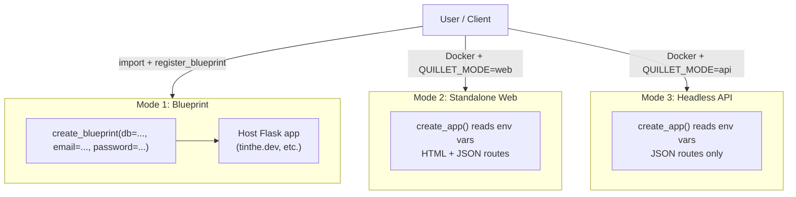

# QUILLET

Flask newsletter + microblog package. Importable Blueprint, standalone web app, or headless API.

---

## Repo structure (new standalone repo)

```
quillet/
├── quillet/
│   ├── __init__.py          # public API: create_blueprint, create_app
│   ├── models.py            # Newsletter, Post, Subscriber NamedTuples
│   ├── auth.py              # HTTP Basic Auth decorator
│   ├── routes.py            # public route handlers (mode-aware)
│   ├── admin.py             # admin UI route handlers (Basic Auth, optional)
│   ├── cli.py               # flask quillet ... CLI commands
│   ├── db/
│   │   ├── __init__.py      # NewsletterRepository Protocol
│   │   ├── sqlalchemy.py    # SQLAlchemy impl (SQLite + Postgres/Supabase)
│   │   └── supabase_rest.py # Supabase REST API impl (no connection string)
│   ├── email/
│   │   ├── __init__.py      # EmailSender Protocol
│   │   ├── mailgun.py       # Mailgun HTTP API
│   │   └── smtp.py          # generic SMTP (stdlib smtplib)
│   └── templates/
│       └── quillet/         # namespaced to avoid host-app collisions
│           ├── base.html
│           ├── post_list.html
│           ├── post_detail.html
│           ├── subscribe_confirm.html
│           └── admin/
│               ├── dashboard.html   # post list + subscriber count
│               ├── post_form.html   # create / edit post
│               └── subscribers.html
├── Dockerfile
├── docker-compose.yml       # with SQLite volume mount example
├── pyproject.toml
└── README.md
```

---

## Three modes




### Mode 1 — Blueprint (1-5 lines of integration)

```python
from quillet import create_blueprint
from quillet.db.sqlalchemy import SQLAlchemyRepository
from quillet.email.mailgun import MailgunSender

app.register_blueprint(
    create_blueprint(
        db=SQLAlchemyRepository("sqlite:///newsletter.db"),
        email=MailgunSender(api_key="...", domain="..."),
        admin_password="secret",
    ),
    url_prefix="/newsletter",
)
```

### Mode 2 / 3 — Docker (env-var driven)

`create_app()` reads all config from env vars:

- `QUILLET_MODE` = `web` (default) | `api`
- `QUILLET_ADMIN_PASSWORD`
- `QUILLET_DB_BACKEND` = `sqlalchemy` | `supabase_rest`
- `QUILLET_DB_URL` (SQLAlchemy connection string)
- `QUILLET_SUPABASE_URL`, `QUILLET_SUPABASE_KEY`
- `QUILLET_EMAIL_BACKEND` = `mailgun` | `smtp`
- `QUILLET_MAILGUN_API_KEY`, `QUILLET_MAILGUN_DOMAIN`
- `QUILLET_SMTP_HOST`, `QUILLET_SMTP_PORT`, etc.

---

## Template override mechanism (Mode 2)

Flask resolves templates: **app templates dir > blueprint templates dir**.

- **Blueprint mode**: host app places overrides at `templates/quillet/post_list.html` — Flask finds them first automatically. No config needed.
- **Standalone Docker**: mount a volume to `/app/templates/quillet/`. The Dockerfile exposes this path. Default templates are minimal/unstyled so they're easy to replace.

---

## Data models

```python
# models.py — all NamedTuples, immutable
class Newsletter(NamedTuple):
    id: int
    slug: str
    name: str
    from_email: str
    from_name: str
    reply_to: str | None

class Post(NamedTuple):
    id: int
    newsletter_id: int
    slug: str
    title: str
    body_md: str
    published_at: datetime | None
    sent_at: datetime | None      # None = not yet emailed

class Subscriber(NamedTuple):
    id: int
    newsletter_id: int
    email: str
    token: str                    # used for confirm + unsubscribe URLs
    confirmed_at: datetime | None
```

---

## Plugin protocols

```python
# db/__init__.py
class NewsletterRepository(Protocol):
    def get_newsletter(self, slug: str) -> Newsletter | None: ...
    def list_posts(self, newsletter_slug: str, published_only: bool = True) -> list[Post]: ...
    def get_post(self, newsletter_slug: str, post_slug: str) -> Post | None: ...
    def create_post(self, newsletter_slug: str, title: str, body_md: str) -> Post: ...
    def publish_post(self, post_id: int) -> Post: ...
    def mark_sent(self, post_id: int) -> None: ...
    def add_subscriber(self, newsletter_slug: str, email: str) -> Subscriber: ...
    def confirm_subscriber(self, token: str) -> Subscriber | None: ...
    def list_confirmed_subscribers(self, newsletter_slug: str) -> list[Subscriber]: ...
    def unsubscribe(self, token: str) -> None: ...

# email/__init__.py
class EmailSender(Protocol):
    def send_confirmation(self, newsletter: Newsletter, subscriber: Subscriber, confirm_url: str) -> None: ...
    def send_post(self, newsletter: Newsletter, post: Post, subscribers: list[Subscriber]) -> None: ...
```

Anyone can implement these protocols to add new backends (Postmark, DynamoDB, etc.) without touching library internals.

---

## Routes (multi-newsletter, all prefixed by `/<newsletter_slug>`)


| Method | Path                                      | Auth       | Notes                                               |
| ------ | ----------------------------------------- | ---------- | --------------------------------------------------- |
| GET    | `/<slug>/`                                | —          | post list                                           |
| GET    | `/<slug>/posts/<post_slug>`               | —          | post detail                                         |
| POST   | `/<slug>/subscribe`                       | —          | creates unconfirmed subscriber, sends confirm email |
| GET    | `/<slug>/confirm/<token>`                 | —          | marks subscriber confirmed                          |
| GET    | `/<slug>/unsubscribe/<token>`             | —          | removes subscriber                                  |
| POST   | `/<slug>/admin/posts`                     | Basic Auth | create post                                         |
| POST   | `/<slug>/admin/posts/<post_slug>/publish` | Basic Auth | set published_at                                    |
| POST   | `/<slug>/admin/posts/<post_slug>/send`    | Basic Auth | email all confirmed subscribers                     |
| GET    | `/<slug>/admin/subscribers`               | Basic Auth | list subscribers                                    |


In `api` mode: all responses are JSON. In `web` mode: HTML for public routes, JSON for admin routes (admin is always API-shaped).

---

## CLI

```bash
flask quillet create "My Blog" --slug=blog
flask quillet list-newsletters
flask quillet send blog <post-slug>     # manual send trigger
flask quillet subscribers blog
```

---

## DB: SQLAlchemy vs Supabase REST

- `SQLAlchemyRepository` — uses SQLAlchemy 2.x Core (not ORM), handles SQLite and Postgres transparently. Runs `create_all()` on first use. This covers 95% of use cases including Supabase via its Postgres connection string.
- `SupabaseRestRepository` — uses Supabase's HTTP REST API (like the current tinthe `/book-call` pattern). For serverless / API-key-only deployments where a persistent DB connection isn't available.

---

## pyproject.toml optional extras

```toml
[project.optional-dependencies]
sqlalchemy = ["SQLAlchemy>=2.0"]
mailgun   = ["requests>=2.31"]
smtp      = []               # stdlib only
supabase  = ["requests>=2.31"]
all       = ["SQLAlchemy>=2.0", "requests>=2.31"]
```

---

## Admin UI

A minimal, dependency-free HTML interface living at `/<slug>/admin/`. All routes require Basic Auth. Enabled by default, disabled via:

- Blueprint: `create_blueprint(..., admin_ui=False)`
- Standalone/Docker: `QUILLET_ADMIN_UI=false`

In `api` mode the admin UI is automatically disabled (API-only, no HTML).

### Admin routes

- `GET /<slug>/admin/` — dashboard: paginated post list with status badges (draft / published / sent), total subscriber count
- `GET /<slug>/admin/posts/new` — blank post form
- `POST /<slug>/admin/posts/new` — create post, redirect to edit view
- `GET /<slug>/admin/posts/<post_slug>/edit` — edit post (title, body, slug)
- `POST /<slug>/admin/posts/<post_slug>/edit` — save edits
- `POST /<slug>/admin/posts/<post_slug>/publish` — set `published_at`, redirect to dashboard
- `POST /<slug>/admin/posts/<post_slug>/send` — trigger email send, redirect to dashboard
- `GET /<slug>/admin/subscribers` — subscriber list with confirm status

### UI philosophy

- Plain HTML forms, zero JS, zero external CSS dependencies
- Inline `<style>` block, ~50 lines — functional, not pretty
- All actions are POST forms (no AJAX) so it works without JS and is trivially overridable
- Template override works the same way: drop `templates/quillet/admin/dashboard.html` in your host app to replace the default

---

## What this is NOT

- No admin UI (CRUD is via API/CLI — keeps scope tight, though an optional built-in UI is available)
- No comment system (reply-to-email approach; Giscus can be added in templates)
- No auth beyond Basic Auth (host app can wrap routes with its own decorator)

